# EliteX V8 - Agent Tools Architecture Diagram

## Complete System Visualization: 9 Agents × 42 Tools

```mermaid
graph TD
    subgraph "🎯 MANAGER AGENT - 19 Tools | Client Context & Orchestration"
        M[<b>Manager Agent</b>]
        
        subgraph "Core Client Data - 6 tools"
            M1[Client Profile &<br/>Demographics]:::coreData
            M2[RM Details]:::coreData
            M3[Share of Wallet]:::coreData
            M4[⭐ Credit/Debit Card<br/>Transaction Analysis]:::highlight
            M5[CASA Balances &<br/>Banking Relationships]:::coreData
            M8[Investment Portfolio<br/>Summary]:::coreData
        end
        
        subgraph "Compliance & Risk - 3 tools"
            M11[Credit Bureau<br/>Alerts & Risk]:::compliance
            M12[Product Maturity &<br/>Renewal in 6M]:::compliance
            M13[KYC Expiry<br/>Tracking]:::compliance
        end
        
        subgraph "Engagement - 3 tools"
            M6[Client Engagement<br/>History]:::engagement
            M7[Communication<br/>Timeline]:::engagement
            M10[Recommended Actions<br/>Dashboard]:::engagement
        end
        
        subgraph "Portfolio Risk - 2 tools"
            M14[Asset Allocation<br/>Mismatch Detection]:::portfolio
            M15[Concentration Risk<br/>Detection]:::portfolio
        end
        
        subgraph "Insurance - 1 tool"
            M9[Insurance Holdings<br/>Summary]:::insurance
        end
        
        subgraph "Triggers & Opportunities - 4 tools"
            M16[Relationship Tenure<br/>Milestones]:::trigger
            M17[Segment Upgrade<br/>Eligibility]:::trigger
            M18[Attrition Risk<br/>Detection]:::trigger
            M19[Service Recovery<br/>Opportunities]:::trigger
        end
        
        M1 & M2 & M3 & M4 & M5 & M6 & M7 & M8 & M9 & M10 & M11 & M12 & M13 & M14 & M15 & M16 & M17 & M18 & M19 --> M
    end
    
    subgraph "🛡️ RISK & COMPLIANCE AGENT - 2 Tools | Risk Assessment"
        R[<b>Risk & Compliance Agent</b>]
        R1[Client Profile &<br/>Demographics]:::coreData
        R2[Risk Compliance<br/>Data]:::compliance
        R1 & R2 --> R
    end
    
    subgraph "📊 ASSET ALLOCATION AGENT - 3 Tools | Portfolio Rebalancing"
        AA[<b>Asset Allocation Agent</b>]
        AA1[Client Profile &<br/>Demographics]:::coreData
        AA2[Asset Allocation<br/>Analysis & Rebalancing]:::portfolio
        AA3[Portfolio Risk<br/>Metrics]:::portfolio
        AA1 & AA2 & AA3 --> AA
    end
    
    subgraph "🌍 MARKET INTELLIGENCE AGENT - 4 Tools | Economic Context"
        MI[<b>Market Intelligence Agent</b>]
        MI1[Market Data &<br/>Indices]:::market
        MI2[Economic<br/>Indicators]:::market
        MI3[Risk<br/>Scenarios]:::market
        MI4[Interest Rate<br/>Opportunities]:::market
        MI1 & MI2 & MI3 & MI4 --> MI
    end
    
    subgraph "📈 INVESTMENT AGENT - 10 Tools | Portfolio Recommendations"
        I[<b>Investment Agent</b>]
        
        subgraph "Core Investment Data - 4 tools"
            I1[Client Profile &<br/>Demographics]:::coreData
            I2[Investment Portfolio<br/>Summary]:::coreData
            I3[Products Not<br/>Currently Held]:::product
            I4[Share of Wallet]:::coreData
        end
        
        subgraph "Product Catalogs - 3 tools"
            I5[Mutual Funds<br/>Catalog]:::product
            I6[Bonds<br/>Catalog]:::product
            I7[Stocks<br/>Catalog]:::product
        end
        
        subgraph "Investment Triggers - 3 tools"
            I8[Large Cash Inflow<br/>Detection]:::trigger
            I9[Underperforming<br/>Holdings Analysis]:::trigger
            I10[Excess Liquidity<br/>Optimization]:::trigger
        end
        
        I1 & I2 & I3 & I4 & I5 & I6 & I7 & I8 & I9 & I10 --> I
    end
    
    subgraph "💳 LOAN AGENT - 10 Tools | Credit & Lending"
        L[<b>Loan Agent</b>]
        
        subgraph "Credit Analysis - 5 tools"
            L1[Comprehensive<br/>Loan Data]:::coreData
            L2[Client Profile &<br/>Demographics]:::coreData
            L3[⭐ Credit/Debit Card<br/>Transaction Analysis]:::highlight
            L4[Risk Compliance<br/>Data]:::compliance
            L5[CASA Balances &<br/>Banking Relationships]:::coreData
        end
        
        subgraph "Loan Products - 2 tools"
            L6[Eligibility-Filtered<br/>Loan Products]:::product
            L7[Complete Loan<br/>Products Catalog]:::product
        end
        
        subgraph "Lending Triggers - 3 tools"
            L8[High Credit<br/>Utilization Detection]:::trigger
            L9[Loan Payoff<br/>Timing]:::trigger
            L10[Interest Rate<br/>Opportunities]:::trigger
        end
        
        L1 & L2 & L3 & L4 & L5 & L6 & L7 & L8 & L9 & L10 --> L
    end
    
    subgraph "🏦 BANKING AGENT - 5 Tools | Cash Management"
        B[<b>Banking/CASA Agent</b>]
        B1[CASA Balances &<br/>Banking Relationships]:::coreData
        B2[Client Profile &<br/>Demographics]:::coreData
        B3[Excess Liquidity<br/>Optimization]:::trigger
        B4[Dormant Account<br/>Reactivation]:::trigger
        B5[Large Cash Inflow<br/>Detection]:::trigger
        B1 & B2 & B3 & B4 & B5 --> B
    end
    
    subgraph "🛡️ BANCASSURANCE AGENT - 6 Tools | Insurance & Protection"
        BA[<b>Bancassurance Agent</b>]
        
        subgraph "Insurance Analysis - 4 tools"
            BA1[Insurance Holdings<br/>Summary]:::insurance
            BA2[ML-Driven Insurance<br/>Needs]:::insurance
            BA3[Lifecycle Trigger<br/>Analysis]:::insurance
            BA4[Insurance Gap<br/>Analysis]:::insurance
        end
        
        subgraph "Insurance Triggers - 2 tools"
            BA5[Lifecycle Milestones &<br/>Age Opportunities]:::trigger
            BA6[Life Event Detection<br/>from Spending]:::trigger
        end
        
        BA1 & BA2 & BA3 & BA4 & BA5 & BA6 --> BA
    end
    
    subgraph "🎯 RM STRATEGY AGENT - 0 Tools | Final Synthesis"
        RM[<b>RM Strategy Agent</b><br/><i>Receives Structured Output<br/>from All 8 Specialist Agents</i>]
        M --> RM
        R --> RM
        AA --> RM
        MI --> RM
        I --> RM
        L --> RM
        B --> RM
        BA --> RM
    end
    
    subgraph "📤 FINAL OUTPUTS"
        O1[Priority Action Items<br/>Top 7 with Rationale]:::output
        O2[Data-Driven<br/>Talking Points<br/>Top 20]:::output
        O3[Engagement<br/>Questions<br/>Top 20]:::output
        O4[Product Strategies<br/>By Category]:::output
        O5[Executive Summary<br/>for RM]:::output
        RM --> O1 & O2 & O3 & O4 & O5
    end
    
    classDef coreData fill:#4A90E2,stroke:#2E5C8A,stroke-width:2px,color:#fff
    classDef compliance fill:#9B59B6,stroke:#6C3483,stroke-width:2px,color:#fff
    classDef engagement fill:#1ABC9C,stroke:#117A65,stroke-width:2px,color:#fff
    classDef portfolio fill:#27AE60,stroke:#1E8449,stroke-width:2px,color:#fff
    classDef insurance fill:#E74C3C,stroke:#C0392B,stroke-width:2px,color:#fff
    classDef trigger fill:#F39C12,stroke:#D68910,stroke-width:2px,color:#fff
    classDef market fill:#34495E,stroke:#1C2833,stroke-width:2px,color:#fff
    classDef product fill:#16A085,stroke:#0E6655,stroke-width:2px,color:#fff
    classDef highlight fill:#FFD700,stroke:#FFA500,stroke-width:3px,color:#000,font-weight:bold
    classDef output fill:#8E44AD,stroke:#5B2C6F,stroke-width:2px,color:#fff
    
    style M fill:#4A90E2,stroke:#2E5C8A,stroke-width:4px,color:#fff,font-weight:bold
    style R fill:#9B59B6,stroke:#6C3483,stroke-width:4px,color:#fff,font-weight:bold
    style AA fill:#27AE60,stroke:#1E8449,stroke-width:4px,color:#fff,font-weight:bold
    style MI fill:#34495E,stroke:#1C2833,stroke-width:4px,color:#fff,font-weight:bold
    style I fill:#27AE60,stroke:#1E8449,stroke-width:4px,color:#fff,font-weight:bold
    style L fill:#F39C12,stroke:#D68910,stroke-width:4px,color:#fff,font-weight:bold
    style B fill:#E67E22,stroke:#CA6F1E,stroke-width:4px,color:#fff,font-weight:bold
    style BA fill:#E74C3C,stroke:#C0392B,stroke-width:4px,color:#fff,font-weight:bold
    style RM fill:#8E44AD,stroke:#5B2C6F,stroke-width:5px,color:#fff,font-weight:bold
```

## 🎨 Color Legend

### Tool Categories (Color-Coded)
| Color | Category | Description |
|-------|----------|-------------|
| 🔵 **Blue** | Core Client Data | Demographics, profiles, basic client information |
| 🟣 **Purple** | Compliance & Risk | KYC, AECB, regulatory data |
| 🟢 **Teal** | Engagement | Communication logs, interaction history |
| 🟢 **Green** | Portfolio | Asset allocation, holdings, risk metrics |
| 🔴 **Red** | Insurance | Bancassurance holdings, gap analysis |
| 🟠 **Orange** | Triggers & Opportunities | Sales triggers, lifecycle events |
| ⚫ **Dark Gray** | Market Intelligence | Economic indicators, market data |
| 🟦 **Cyan** | Product Catalogs | Funds, bonds, stocks, loan catalogs |
| ⭐ **Gold** | **Highlighted Tool** | Credit/Debit Card Transaction Analysis |
| 🟣 **Dark Purple** | Outputs | Final RM strategy deliverables |

### Agent Summary
| Agent | Tools | Role |
|-------|-------|------|
| 🎯 **Manager** | 19 | Orchestrator - Sets context for all agents |
| 🛡️ **Risk & Compliance** | 2 | Risk assessment & regulatory guidelines |
| 📊 **Asset Allocation** | 3 | Portfolio rebalancing recommendations |
| 🌍 **Market Intelligence** | 4 | Economic context & market insights |
| 📈 **Investment** | 10 | Investment product recommendations |
| 💳 **Loan** | 10 | Credit opportunities & lending analysis |
| 🏦 **Banking** | 5 | CASA optimization & cash management |
| 🛡️ **Bancassurance** | 6 | Insurance gap analysis & protection |
| 🎯 **RM Strategy** | 0 | Final synthesis & actionable strategy |

## 📊 Key Statistics

- **Total Tools:** 42
- **Total Agents:** 9
- **Shared Tools:** 8 tools used across multiple agents
- **Most Connected Tool:** Client Profile & Demographics (6 agents)
- **⭐ Highlighted Tool:** Credit/Debit Card Transaction Analysis (Manager + Loan agents)

## 🔄 Data Flow

**Sequential Execution:**
1. Manager Agent gathers comprehensive client context (19 tools)
2. Risk & Compliance validates risk profile (2 tools)
3. Asset Allocation analyzes portfolio balance (3 tools)
4. Market Intelligence provides economic context (4 tools)
5. Investment Agent recommends products (10 tools)
6. Loan Agent assesses credit opportunities with spending analysis ⭐ (10 tools)
7. Banking Agent optimizes cash management (5 tools)
8. Bancassurance identifies insurance gaps (6 tools)
9. RM Strategy synthesizes all outputs into action plan (0 tools - pure synthesis)
